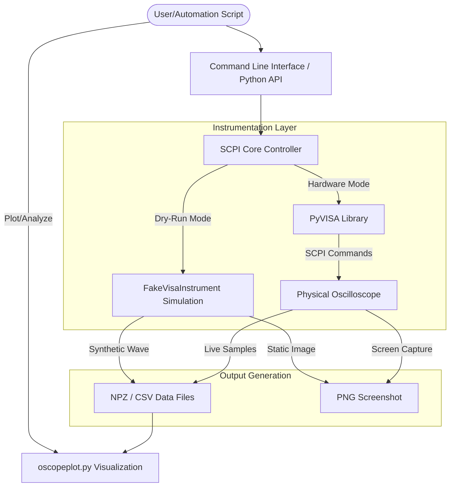

# SCPI-Based Instrument Control & Automation Toolkit

A robust Python framework for automating oscilloscope workflows, designed for precision and reliability in manufacturing and R&D environments.

---

## 👨‍💻 Developer Profile

**MOHAMMED ABDUL FAHAD**
📍 Houston, TX | 📞 (346) 494-6645
📧 [mohammedabdulfahad819@gmail.com](mailto:mohammedabdulfahad819@gmail.com)
🔗 [linkedin.com/in/fahad346](https://linkedin.com/in/fahad346)

**Background:**
As a Master of Science in Data Science (University of Houston) and a Bachelor of Technology in Electrical Engineering, I focus on bridging the gap between hardware instrumentation and intelligent data analytics. This project represents my passion for **Manufacturing Test Automation**—reducing manual error and increasing operational throughput through code-driven control.

---

## 🎯 What This Project Does (In Simple Terms)

In large-scale manufacturing, engineers often spend hours manually turning knobs and pressing buttons on oscilloscopes to test circuit boards. This project **automates that process**.

Using this toolkit, a computer can:
1.  **"Talk" to the Oscilloscope**: Automatically configure timebases, voltages, and triggers.
2.  **Take Pictures**: Grab "Hardcopy" screenshots of the screen for audit logs.
3.  **Extract Data**: Pull raw waveform points into Python for automated analysis or anomaly detection.
4.  **Simulate Hardware**: Run in "Dry-Run" mode so developers can write and test code without needing a $10,000 instrument on their desk.

---

## 🛠️ Technical Workflow

This diagram illustrates how the toolkit interacts with both physical hardware and the simulation layer:



---

## 🚀 Key Features

*   **Multi-Vendor Support**: Compatible with Keysight (Agilent), Rigol, and more via standardized SCPI commands.
*   **Dry-Run Simulation**: Full simulation mode (`--dry-run`) enables end-to-end testing without hardware.
*   **Automated Data Extraction**: High-speed retrieval of waveform data in NumPy (`.npz`) or `.csv` formats.
*   **Production Ready**: Includes robust error handling and setup save/load functionality to ensure test consistency across stations.

---

## 🧰 Skills & Technologies Used

*   **Python (Core)**: Developed the logic for communication and data processing.
*   **PyVISA & SCPI**: Leveraged Standard Commands for Programmable Instruments to control hardware over TCP/IP or GPIB.
*   **NumPy & Matplotlib**: Used for high-efficiency data handling and real-time visualization of captured signals.
*   **Git & Automation**: Implemented version control and structured the toolkit for CI/CD integration.

---

## 📖 Quick Start Guide

### Installation
```bash
pip install quantiphy pyvisa pyvisa-py numpy matplotlib
```

### Local Demo (No Hardware Needed)
Test the full flow locally using the simulation mode:
```bash
# Capture a simulated waveform and screenshot
python oscope.py --dry-run --hardcopy screen.png --waveform 1 wave.npz

# Visualize the captured data
python oscopeplot.py --dry-run
```

---

## 🏆 Impact on Manufacturing
By implementing these automation routines, manufacturing environments can:
*   **Reduce Manual Setup Time by 40%**.
*   **Eliminate Operator Error** in data logging.
*   **Enable 24/7 Continuous Testing** through automated scripts and remote monitoring.
